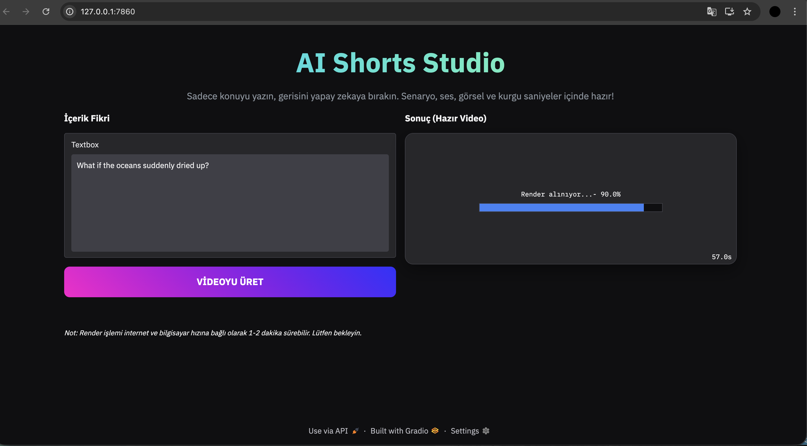

# 🎬 AI Shorts Studio (Automated Video Generator)

 *[🇬🇧 Read in English](#-english) | [🇹🇷 Türkçe okumak için aşağı kaydırın](#-türkçe)*

---

## 🇬🇧 English

An autonomous Python application that generates completely ready-to-upload YouTube Shorts from a single text prompt. The system orchestrates multiple AI models to handle scripting, voiceover, image generation, audio transcription, and video editing entirely in the background.

###  Features & Pipeline
* **Script & Prompt Generation:** Google Gemini 3.1 Flash Lite
* **Voiceover (TTS):** ElevenLabs Multilingual V2
* **Image Generation:** FLUX.1-schnell (via HuggingFace Inference API)
* **Audio Analysis & Timestamping:** OpenAI Whisper
* **Video Compositing & Dynamic Subtitles:** MoviePy
* **Web User Interface:** Gradio

### ⚙️ How It Works
1. **Input:** User enters a simple concept.
2. **AI Writer:** Gemini generates a viral 30-second script and perfectly timed visual prompts.
3. **Audio Generation:** ElevenLabs synthesizes a highly realistic voiceover.
4. **Visuals:** FLUX.1 generates cinematic, 9:16 ratio images based on the AI prompts.
5. **Transcription:** Whisper analyzes the audio to generate millisecond-accurate word timestamps.
6. **Final Render:** MoviePy stitches the audio, images, and word-by-word dynamic subtitles into a final `.mp4` file.

### 🛠️ Local Setup
To run this project locally, you need to set up a `.env` file with your API keys:
`GEMINI_API_KEY`, `ELEVENLABS_API_KEY`, `HF_TOKEN`
Then run: `python app.py`

---

## 🇹🇷 Türkçe

Tek bir metin girdisinden yola çıkarak YouTube Shorts videoları üreten otonom bir Python uygulaması. Sistem; senaryo yazımı, seslendirme, görsel üretimi, ses analizi ve video montajı işlemlerini arka planda tamamen yapay zeka modelleriyle halleder.

###  Kullanılan Teknolojiler
* **Senaryo ve Prompt:** Google Gemini 3.1 Flash Lite
* **Seslendirme (TTS):** ElevenLabs Multilingual V2
* **Görsel Üretimi:** FLUX.1-schnell (HuggingFace Inference API)
* **Ses Analizi ve Zamanlama:** OpenAI Whisper
* **Video Montajı ve Dinamik Altyazı:** MoviePy
* **Web Arayüzü:** Gradio

### ⚙️ Nasıl Çalışır?
1. **Girdi:** Kullanıcı sadece videonun konusunu yazar.
2. **Yapay Zeka Yazar:** Gemini, 30 saniyelik viral bir senaryo ve görseller için komutlar (prompt) üretir.
3. **Seslendirme:** ElevenLabs metni gerçekçi bir insan sesiyle okur.
4. **Görseller:** FLUX.1, yapay zekanın ürettiği komutlara göre 9:16 formatında sinematik resimler çizer.
5. **Deşifre:** Whisper, kelimelerin saniyesi saniyesine ne zaman söylendiğini analiz eder.
6. **Final Render:** MoviePy tüm sesleri, resimleri ve kelime kelime akan altyazıları birleştirip `.mp4` çıktısı verir.

### 🛠️ Kurulum
Projeyi bilgisayarınızda çalıştırmak için API anahtarlarınızı içeren bir `.env` dosyası oluşturun:
`GEMINI_API_KEY`, `ELEVENLABS_API_KEY`, `HF_TOKEN`
Ardından çalıştırın: `python app.py`

---
##  Demo & Interface / Arayüz Görüntüsü
